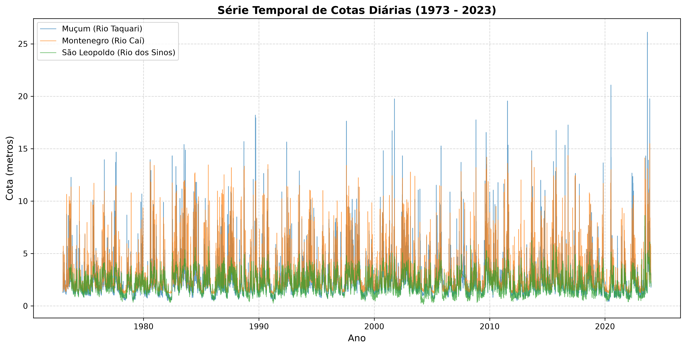

# 🌊 SIPH - Sistema Inteligente de Previsão Hidrológica

> Sistema de aprendizado de máquina para modelagem e previsão de cotas de cheias em bacias hidrográficas afluentes ao Lago Guaíba (Rio Grande do Sul).

[](https://www.python.org/)
[](https://opensource.org/licenses/MIT)
[]()

---

## 📌 Sobre o Projeto

O **SIPH** foi concebido no âmbito do **Programa Voluntário de Iniciação Científica e Tecnológica**, visando desenvolver modelos preditivos de inteligência artificial capazes de antecipar a elevação das cotas dos rios que compõem a Bacia do Guaíba.

Utilizando dados históricos de estações fluviométricas fornecidos pela **Agência Nacional de Águas e Saneamento Básico (ANA)** e pelo **Serviço Geológico do Brasil (SGB)**, o sistema processa séries temporais de 50 anos (1973–2023) para mapear a propagação das ondas de cheia da montante até a capital.

---

## 🗺️ Bacias Mapeadas

 O modelo monitora os principais afluentes da Região Hidrográfica do Guaíba:

| Estação | Rio | Bacia / Região | Período de Dados |
| :--- | :--- | :--- | :--- |
| **86510000** | Rio Taquari | Muçum | 1940 – 2023 |
| **87170000** | Rio Caí | Montenegro | 1947 – 2023 |
| **87382000** | Rio dos Sinos | São Leopoldo | 1973 – 2023 |
| **87010000** | Rio Jacuí | Triunfo | Histórico Legado |
| **87450000** | Lago Guaíba | Porto Alegre (Cais Mauá) | Histórico Legado |

---

## 🏗️ Arquitetura do Repositório

O projeto segue a estrutura padrão para projetos de Ciência de Dados:
```
SIPH/
├── data/
│   ├── raw/             # Arquivos CSV brutos originais do HidroWeb/ANA
│   └── processed/       # Datasets limpos, alinhados e prontos para treino
├── reports/
│   └── figures/         # Gráficos e visualizações geradas (EDA)
├── src/
│   ├── data/            # Scripts para download, limpeza e fusão de dados
│   │   ├── preprocess.py
│   │   └── make_dataset.py
│   ├── features/        # Engenharia de atributos e janelamento temporal
│   │   └── build_features.py
│   └── visualization/   # Plotagem e geração de relatórios visuais
│       └── plot_series.py
├── .gitignore
├── LICENSE
├── main.py
├── README.md
└── requirements.txt
```

## 🚀 Como Executar

### 1. Pré-requisitos
* Python 3.10 ou superior
* Virtualenv configurado

### 2. Instalação
Clone o repositório e instale as dependências:

```bash
git clone https://github.com/LAUDEJACK/SIPH.git
cd SIPH
pip install -r requirements.txt
```

### 3. Pipeline de Dados
1. ***Pré-processamento dos dados brutos:***
```python src/data/preprocess.py```

2. Geração do gráfico da série temporal (EDA):
```python src/visualization/plot_series.py```

3. Consolidação do dataset unificado:
```python src/data/make_dataset.py```

4. Engenharia de Atributos (Features):
```python src/features/build_features.py```

---
## 📈 Visualização dos Dados (1973 - 2023)

---
## 📄 Licença
Este projeto é distribuído sob a licença MIT. Veja o arquivo LICENSE para mais detalhes.
